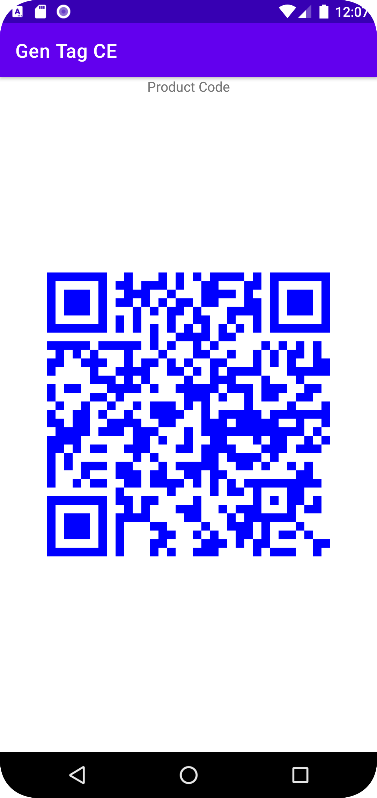

# FBAK

Repository for the Mobile Computing course's group work. 

## Class diagram


## Figma prototype

[Figma prototype](https://www.figma.com/file/4Y4rR6XdTI61CnZNyBUSGq/Acme-electorinc-store?node-id=0%3A1&t=guwb6qmTbyyXrwBA-1)

## QR Codes 

 
 
 
 
 
 
 

## Code to import public key

```
const val THE_CERT = "-----BEGIN CERTIFICATE-----\n" +
          "    MIIBFTCBwKADAgECAgQAuPR8MA0GCSqGSIb3DQEBCwUAMBIxEDAOBgNVBAMTB0FjbWVLZXkwHhcN\n" +
          "    MjMwMzE5MTIxNjEwWhcNNDMwMzE5MTIxNjEwWjASMRAwDgYDVQQDEwdBY21lS2V5MFwwDQYJKoZI\n" +
          "    hvcNAQEBBQADSwAwSAJBAOPca9EgR9hTSVfgrvpbMTRfHiy473tw7Ok4g+sh6PdJS+nrEZbkqmXB\n" +
          "    HjFMiPzIgo9qOs0SPk5Kp5MKAiEFMjUCAwEAATANBgkqhkiG9w0BAQsFAANBAJ8BcI5d6Ymm5d2R\n" +
          "    KRKczwuLZHH05P0nuE8281q5srM7oUNym21y0tQht9oOwMD1Io4lxaVyhpAV26dCc2Jx/4s=\n" +
          "    -----END CERTIFICATE-----"

private fun importPublicKey() {
    try {
      val cert = CertificateFactory.getInstance("X509").generateCertificate(
        ByteArrayInputStream(THE_CERT.toByteArray(StandardCharsets.UTF_8))
      ) as X509Certificate
      val keyStore = KeyStore.getInstance("AndroidKeyStore")
      val keyProtection =
        KeyProtection.Builder(KeyProperties.PURPOSE_ENCRYPT or KeyProperties.PURPOSE_VERIFY)
          .setDigests(KeyProperties.DIGEST_SHA1, KeyProperties.DIGEST_SHA256)
          .setRandomizedEncryptionRequired(true)
          .setEncryptionPaddings(KeyProperties.ENCRYPTION_PADDING_RSA_OAEP)
          .setSignaturePaddings(KeyProperties.SIGNATURE_PADDING_RSA_PSS)
          .setUserAuthenticationRequired(false)
          .build()
      keyStore.load(null)
      keyStore.setEntry("AcmeKey", KeyStore.TrustedCertificateEntry(cert), keyProtection)
    } catch (e: java.lang.Exception) {
      throw RuntimeException(e)
    }
  }
```
